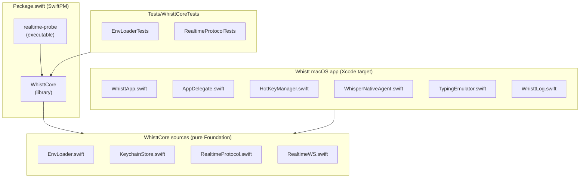
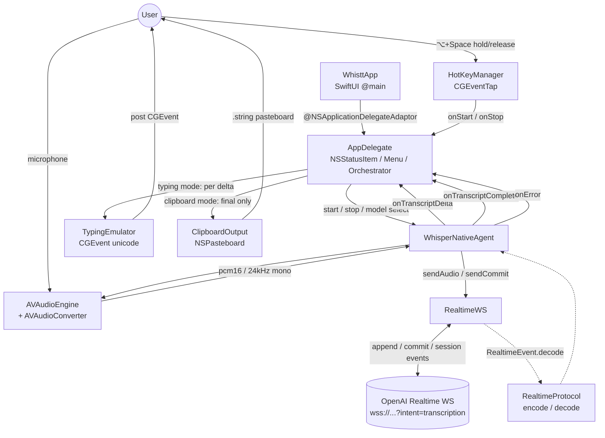
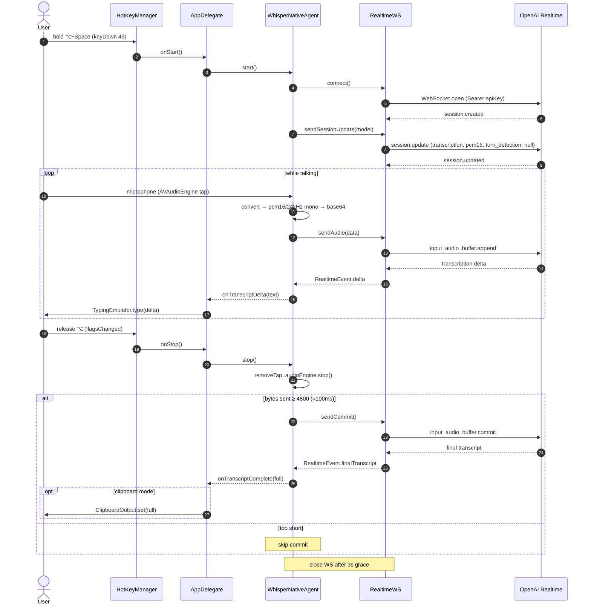
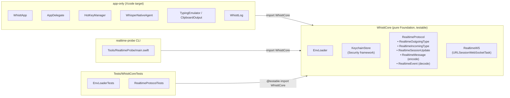

# Whistt Architecture

Internal architecture of the Whistt push-to-talk app for macOS, built on the OpenAI Realtime WebSocket.

## 1. Module layout

SwiftPM provides the `WhisttCore` library and the `realtime-probe` CLI; the Xcode `Whistt` app shares its common logic through `WhisttCore`. Tests and the CLI only consume the pure-Foundation portion that does not touch AVFoundation/AppKit.

## 2. Responsibilities and callback wiring

`AppDelegate` is the orchestrator. `HotKeyManager` callbacks drive `WhisperNativeAgent`, and the transcript delta/final stream is dispatched to the chosen output sink (typing or clipboard).

## 3. Execution sequence (one push-to-talk turn)

## 4. WhisttCore boundary (testable line)

Files that depend on AVFoundation / AppKit / CoreGraphics are confined to the Xcode target, and only the parts that can be written in pure Foundation are extracted into `WhisttCore`. This is what makes both `swift test` and the `realtime-probe` CLI viable consumers.

## Design highlights

- **Three products**: macOS app proper / `WhisttCore` library / `realtime-probe` CLI. The shared logic (`EnvLoader` / `KeychainStore` / `RealtimeProtocol` / `RealtimeWS`) is extracted into WhisttCore so it can be reused by the CLI and unit tests.
- **API key storage**: The app uses `KeychainStore` (generic-password, service `so.lai.whistt`, account `OPENAI_API_KEY`) as the primary source. Lookup order: `ProcessInfo` env > Keychain > legacy `.env` (auto-migrated into the Keychain on first launch, with a one-time notice shown to the user) > re-entry dialog from the menu bar. The CLI / tests continue to read `.env` via `EnvLoader` (the CLI is unsigned and cannot access the app's Keychain entry).
- **Input trigger**: `HotKeyManager` watches ⌥+Space through `CGEventTap` (`cgSessionEventTap` + `headInsertEventTap`). The Space key is swallowed so it never leaks to the frontmost app.
- **Audio path**: Microphone → `AVAudioEngine.inputNode` tap → `AVAudioConverter` to pcm16/24kHz/mono → base64 → `input_audio_buffer.append` over `RealtimeWS` at 10–20 messages/s. `audioAppend` is on the hot path, so it builds the JSON via string interpolation instead of `JSONSerialization`.
- **WS protocol**: Endpoint is `wss://api.openai.com/v1/realtime?intent=transcription`. The URL `model=` query parameter targets *conversation* models, so we do not use it; the transcription model goes into `session.audio.input.transcription.model`. `turn_detection: null` forces manual commit.
- **Stop handling**: `audioEngine.stop()` → if at least 4800 bytes (≈100ms) have been sent, emit `input_audio_buffer.commit`. The WS is closed after a 3-second grace period to allow the final transcript to arrive.
- **Output modes**: Typing mode emits each delta into the frontmost app via `CGEvent` Unicode input. Clipboard mode writes only the final transcript to `NSPasteboard`, so clipboard-history tools don't capture intermediate state.
- **Testability boundary**: AVFoundation / AppKit code lives in the app target; only pure-Foundation code is separated into WhisttCore. This is what enables both `swift test` and CLI validation.
