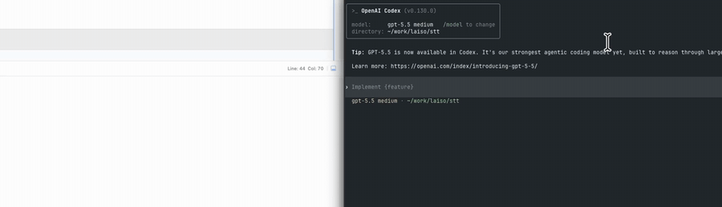
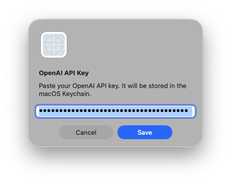
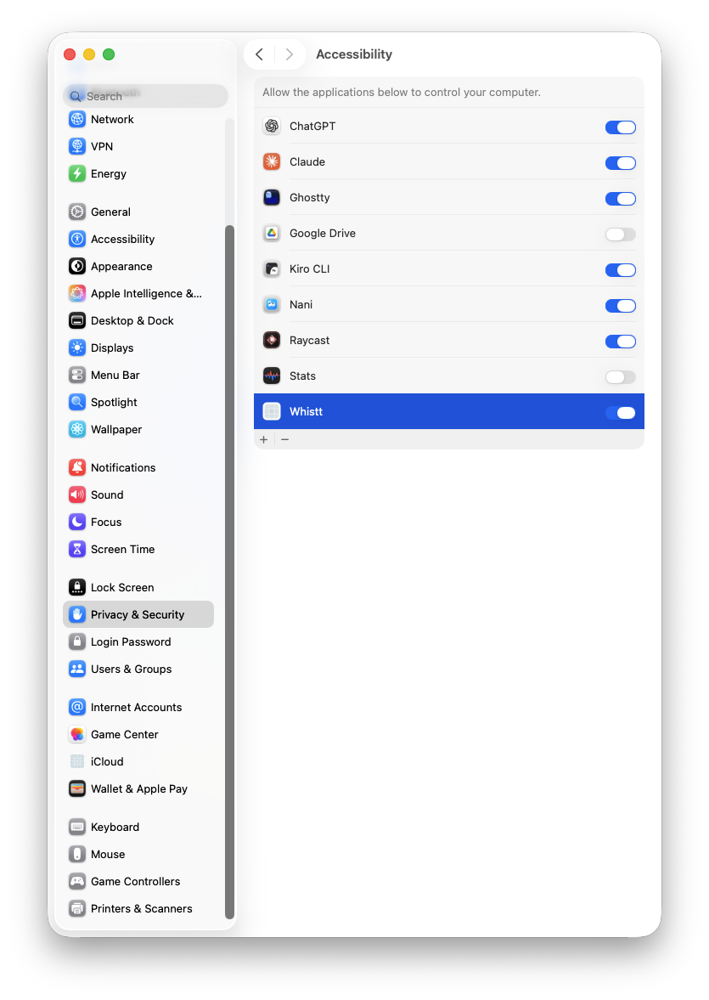
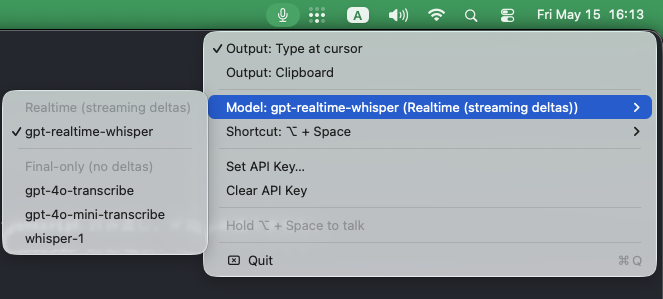
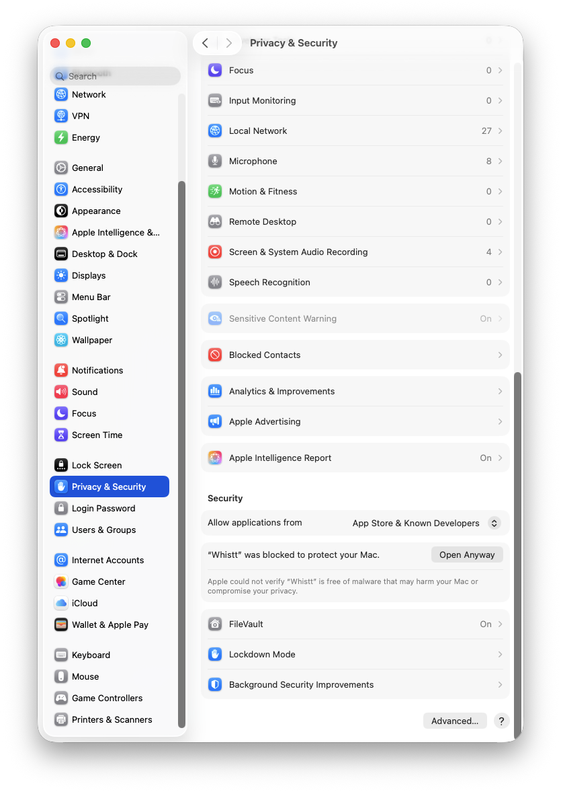

# Whistt — Mac native real-time voice input

Hold **⌥ Option + Space** to talk; speech is streamed to OpenAI Realtime, Google Gemini Live Transcription, Meta Muse Voice Transcribe, xAI streaming Speech-to-Text, or Microsoft Azure Voice Live and the resulting text is typed at the current cursor position.



Menu Bar app. Native Swift / AVFoundation / URLSessionWebSocketTask — no third-party deps.

## Why Whistt?

Most voice-input apps hide the transcription model behind their service. Whistt is an open-source client for trying newly released real-time transcription models in an actual macOS dictation workflow: choose the provider and model, bring your own API key, and compare results without an opaque intermediary.

## Provider comparison

| Provider | Model | Interim results | Required settings | Reference price/hour |
|---|---|---|---|---:|
| Microsoft (preview) | `mai-transcribe-2` | None (final only) | `AZURE_SPEECH_API_KEY` + Endpoint | **$0.10**※ |
| Meta | `muse-voice-transcribe-1.0` | None (final only) | `META_API_KEY` | **$0.18** |
| xAI | Streaming STT | Revising internally (final only) | `XAI_API_KEY` | **$0.20** |
| OpenAI | `gpt-transcribe` | None (after-turn transcription) | `OPENAI_API_KEY` | **$0.27** |
| Gemini | `gemini-3.5-transcribe-live` | Revising (not typed) | `GEMINI_API_KEY` | **approx. $0.54** |
| OpenAI | `gpt-realtime-whisper` | Streaming deltas (typed live) | `OPENAI_API_KEY` | **$1.02** |

Reference prices as of September 2026. ※ Limited-time introductory rate for `mai-transcribe-2`; Voice Live is a preview feature and whether this rate applies to the Voice Live route (including the hosted conversation model charge) must be confirmed on the actual Azure bill. OpenAI's `gpt-transcribe` is primarily after-turn transcription and is not yet selectable in Whistt's model menu.

## Requirements

- macOS 26.2+ / Xcode 16+
- At least one provider API key:
  - OpenAI API key with Realtime API access — <https://platform.openai.com/api-keys>
  - Google Gemini API key with Live API access
  - Meta Model API key with Muse Voice Transcribe access — <https://dev.meta.ai/>
  - xAI API key with streaming Speech-to-Text access — <https://console.x.ai/>
  - Azure Speech resource endpoint with Voice Live preview access (supplies `AZURE_SPEECH_API_KEY` and `AZURE_SPEECH_ENDPOINT`)
  - Gemini API key — <https://aistudio.google.com/app/apikey>

## Run

1. Open `Whistt/Whistt.xcodeproj` and ⌘R.
2. Paste the selected provider's API key when prompted. OpenAI, Gemini, Meta, xAI, and Azure keys are stored as separate entries in the macOS Keychain.

   
3. Grant **Microphone** + **Accessibility** permissions in System Settings, then relaunch.

   
4. Hold ⌥+Space, speak, release — text appears at your cursor.

Switch between **Type at cursor** / **Clipboard** output and pick a transcription model from the menu bar. OpenAI uses the realtime-only `gpt-realtime-whisper`. Gemini uses `gemini-3.5-transcribe-live`, Japanese (`ja-JP`), and manual push-to-talk VAD. Its interim hypotheses are not typed because they can revise earlier text; only finalized text is inserted. xAI receives streaming revisions from `wss://api.x.ai/v1/stt`, but keeps them internal and inserts only the final transcript once recording finishes. Azure Voice Live (preview) uses `mai-transcribe-2`, streams PCM16/24kHz to the hosted Voice Live WebSocket, and inserts only the final transcript; language is auto-detected.

Open **Settings…** from the menu to choose the output mode, model, push-to-talk shortcut, launch-at-login behavior, and recording-start sound. The Providers tab adds, replaces, or removes keys for OpenAI, Gemini, Meta, xAI, and Azure in one place. Azure additionally stores its Voice Live endpoint (e.g. `https://<resource>.services.ai.azure.com/`) in preferences; the API key stays in the Keychain. For local development, `OPENAI_API_KEY`, `GEMINI_API_KEY`, `META_API_KEY`, `XAI_API_KEY`, `AZURE_SPEECH_API_KEY`, and `AZURE_SPEECH_ENDPOINT` can be supplied through process environment variables or `.env`; the selected provider's key is migrated to Keychain on first use and environment values take precedence over saved settings. If a selected provider is not configured, the app opens the Providers tab.



### Run the development build from Terminal

From the repository root, build the Debug app, export the values in `.env` to the app process, and launch it in the foreground:

```sh
xcodebuild \
  -project Whistt/Whistt.xcodeproj \
  -scheme Whistt \
  -configuration Debug \
  -derivedDataPath .build/xcode \
  build

set -a
source .env
set +a
.build/xcode/Build/Products/Debug/Whistt.app/Contents/MacOS/Whistt
```

The process environment takes precedence over Keychain, so this launch method uses provider keys from the repository's `.env`. Keep this terminal open while using Whistt; press `Ctrl-C` to stop it. The `.env` file must contain shell-compatible `KEY=value` entries and should have mode `600` (`chmod 600 .env`).


## Install from GitHub Release (unsigned)

Releases are distributed **unsigned**, so the first launch from `/Applications/` will be blocked by Gatekeeper. Two ways to bypass:

- **Terminal**: `xattr -dr com.apple.quarantine /Applications/Whistt.app`
- **GUI**: open System Settings → Privacy & Security, scroll to the "Whistt was blocked to protect your Mac" row and click **Open Anyway**.

  

## Troubleshooting

- **No text appears** — Accessibility permission isn't granted to `Whistt.app`.
- **Space leaks into the focused app** — Accessibility wasn't granted yet; the app auto-recovers within ~2 s after granting (no relaunch needed since v0.1.1).
- **Key dialog reappears** — the Keychain entry is missing or empty; paste the key again.
- **Gemini finishes but no text appears** — confirm that `gemini-3.5-transcribe-live` is selected and the Gemini key has Live API access.

### Local diagnostics

Build and launch the Debug app while showing its logs in the terminal and saving them to `debug.log`:

```bash
make debug
```

The command loads `.env` when present and uses a provider key from it directly, without accessing Keychain for that provider. Keys that are absent from `.env` fall back to the normal Keychain behavior. A normal app launch remains Keychain-first. Stop the app with Control-C. `debug.log` is local-only and ignored by Git.

Other development commands:

```bash
make build
make test
```

## Gemini Live API probe

The end-to-end probe sends raw PCM16LE, 16 kHz, mono audio through the same Gemini wire protocol used by the app:

```sh
swift run gemini-live-probe /path/to/audio.raw
```

It reads `GEMINI_API_KEY` through `EnvLoader`, never prints the credential, and exits successfully only after receiving a finalized transcript.

Meta's probe accepts raw PCM16LE, 24 kHz, mono audio and sends it at real-time pace:

```bash
swift run meta-live-probe /path/to/audio.raw
```

It reads `META_API_KEY` through `EnvLoader`, authenticates inside the WebSocket handshake, and sends `endStream` after the audio queue drains.

## xAI streaming STT probe

xAI's probe accepts raw PCM16LE, 16 kHz, mono audio and paces it at real time:

```
swift run xai-live-probe /path/to/audio.raw
```

It reads `XAI_API_KEY` through `EnvLoader`, waits for `transcript.created`, streams PCM to `wss://api.x.ai/v1/stt`, and prints the transcript when `audio.done` finalization returns. Language is auto-detected.

## Azure Voice Live probe

The Azure probe accepts raw PCM16LE, 24 kHz, mono audio and drives the app's `AzureVoiceLiveTransport` end to end:

```
swift run azure-voice-live-probe /path/to/audio.raw
```

It reads `AZURE_SPEECH_API_KEY` and `AZURE_SPEECH_ENDPOINT` through `EnvLoader`, configures `mai-transcribe-2` in the Voice Live session with automatic turn detection disabled, streams audio at real-time pace, and prints the final transcript. Run without arguments it only verifies session setup.

## More

- Architecture & module layout → `ARCHITECTURE.md`.
- Product specifications and acceptance scenarios → `docs/specs/`.
- Key sources (env var override, legacy `.env` migration), advanced model notes → ARCHITECTURE.md "Design highlights".
