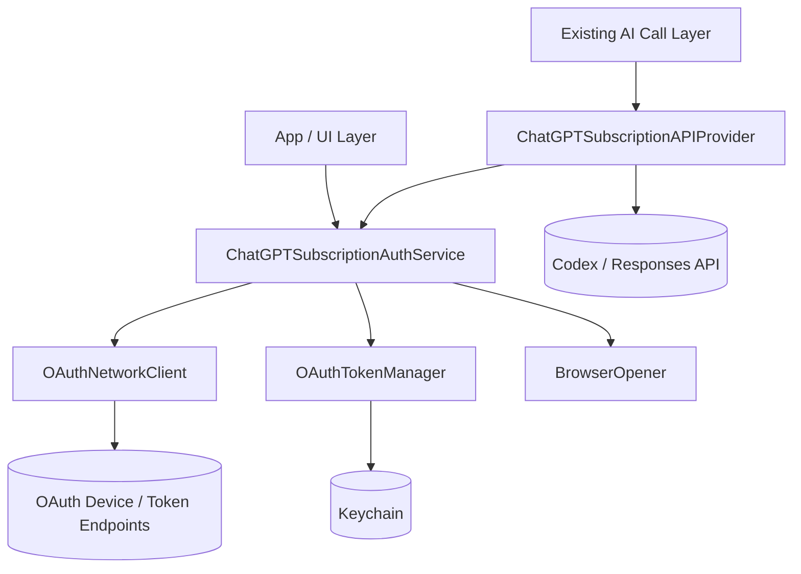
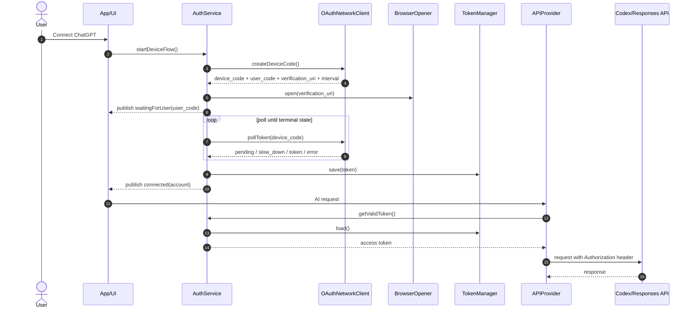

# ChatGPT Subscription Integration Module Design

## 1. Purpose

Allow Whistt users to bring their own ChatGPT/Codex OAuth subscription and use that account's entitlement, limits, and billing path for AI calls instead of an OpenAI API key.

This module is provider-oriented: the rest of the app should consume an authenticated AI provider uniformly, regardless of whether credentials come from an API key or a ChatGPT subscription OAuth token.

## 2. Scope

### In scope

- Device Code Flow authentication.
- Access token, refresh token, expiry, and account metadata management.
- Token validity checks and automatic refresh.
- Authorization/header injection for Codex/OpenAI Responses-compatible calls.
- OAuth/API error handling and user-action guidance.
- Auth state notification to app/UI layers.

### Out of scope

- Detailed UI screen design.
- Multiple simultaneous ChatGPT accounts.
- Server-side token brokerage.
- Provider-specific prompt/model policy decisions.

## 3. Constraints and assumptions

- OAuth endpoint URLs, `client_id`, and scopes must be configuration-driven because Codex/ChatGPT subscription OAuth details may change.
- The module must not expose refresh tokens outside the auth/token layer.
- The module should compile/test without AppKit/UIKit where possible; browser-opening is injected as a platform dependency.
- API-key auth remains supported as a separate provider.

## 4. Module layout



## 5. Public interfaces

### `ChatGPTSubscriptionAuthService`

Singleton is acceptable at the app layer, but implementation should depend on protocols for tests.

```swift
protocol ChatGPTSubscriptionAuthServicing {
    var authState: AuthState { get }

    func startDeviceFlow() async throws
    func refreshTokenIfNeeded(force: Bool) async throws
    func getValidToken() async throws -> String
    func logout() async throws
}
```

Responsibilities:

- Orchestrate Device Code Flow.
- Open verification URL in browser.
- Poll until success, expiry, cancellation, or fatal error.
- Persist resulting token set.
- Refresh tokens proactively when near expiry.
- Publish auth state changes.

### `OAuthTokenManager`

```swift
protocol OAuthTokenManaging {
    func load() throws -> StoredOAuthToken?
    func save(_ token: StoredOAuthToken) throws
    func delete() throws
    func isRefreshRequired(_ token: StoredOAuthToken, now: Date) -> Bool
}
```

Stored fields:

- `accessToken`
- `refreshToken`
- `expiresAt`
- `scope`
- `tokenType`
- `accountInfo` (`email`, `displayName`, `subject`, optional avatar URL)

Keychain storage:

- `kSecClassGenericPassword`
- service: `com.whistt.chatgpt-subscription`
- account: stable account key, initially `default`
- accessibility: `kSecAttrAccessibleAfterFirstUnlockThisDeviceOnly` or stricter if UX allows

### `OAuthNetworkClient`

Responsibilities:

- Request device/user code.
- Exchange device code for tokens.
- Refresh tokens.
- Map OAuth wire errors to typed domain errors.

```swift
enum OAuthPollingResult {
    case pending
    case slowDown(seconds: TimeInterval)
    case authorized(TokenResponse)
    case expired
    case denied
}
```

### `ChatGPTSubscriptionAPIProvider`

Responsibilities:

- Retrieve valid access token.
- Add provider-specific headers.
- On `401`/invalid token, force refresh once and retry idempotent or explicitly retryable requests.
- Surface re-auth-required errors to UI.

## 6. Data flow



## 7. Auth state model

```swift
enum AuthState: Equatable {
    case disconnected
    case connecting(userCode: String?, verificationURL: URL?)
    case connected(account: AccountInfo)
    case refreshing(account: AccountInfo?)
    case reauthenticationRequired(reason: AuthError)
}
```

State is published through one of:

- `NotificationCenter` for minimal integration.
- `AsyncStream<AuthState>` or Combine publisher for SwiftUI-friendly integration.

Recommended notification keys:

- `isChatGPTConnected`
- `currentAccountEmail`
- `authState`

## 8. Token lifetime policy

- Treat tokens as expired if `now >= expiresAt - refreshLeeway`.
- Default `refreshLeeway`: 5 minutes.
- Coalesce concurrent refresh calls with a single in-flight task to avoid refresh races.
- If refresh fails with `invalid_grant`, delete stored tokens and transition to `reauthenticationRequired`.
- If refresh fails due to network/server errors, keep tokens and return a retryable error if still within expiry; otherwise require user retry.

## 9. Error handling

### Domain errors

```swift
enum ChatGPTSubscriptionAuthError: Error {
    case userAuthorizationPending
    case authorizationSlowDown
    case deviceCodeExpired
    case authorizationDenied
    case invalidGrant
    case tokenRefreshFailed(underlying: Error)
    case reauthenticationRequired
    case keychainFailure(status: OSStatus)
    case networkFailure(underlying: Error)
    case providerUnauthorized
    case configurationMissing(String)
}
```

### User guidance

- `authorization_pending`: keep waiting; show code and browser link.
- `slow_down`: continue polling with increased interval.
- `expired_token`: ask user to restart connection.
- `access_denied`: show “Connection was cancelled or denied.”
- `invalid_grant`: ask user to reconnect ChatGPT.
- API `401`: refresh once; if still failing, ask user to reconnect.
- API `429`/quota: explain subscription/rate limit and suggest waiting or changing provider.

Developer diagnostics should use `os_log` and must redact tokens and authorization codes.

## 10. Security considerations

- Store all tokens only in Keychain.
- Never log access tokens, refresh tokens, device codes, or authorization headers.
- Keep access tokens in memory only for request construction.
- Prefer dependency injection for `URLSession` to support test stubbing.
- Use TLS-only endpoints.
- Consider account mismatch detection if account metadata changes after refresh.

## 11. Configuration

Configuration can live in `Info.plist`, a build setting, or a Swift config object:

```swift
struct ChatGPTSubscriptionOAuthConfig {
    let clientID: String
    let scope: String
    let deviceAuthorizationEndpoint: URL
    let tokenEndpoint: URL
    let apiBaseURL: URL
    let defaultPollingInterval: TimeInterval
}
```

Fail fast with `configurationMissing` if required values are absent.

## 12. Testing plan

- `OAuthTokenManagerTests`
  - save/load/delete token round trip
  - expiry/leeway logic
  - Keychain error mapping using injectable store where possible
- `OAuthNetworkClientTests`
  - device-code success
  - polling errors: pending, slow_down, expired, denied, invalid_grant
  - malformed responses
- `AuthServiceTests`
  - successful device flow
  - slow_down interval adjustment
  - refresh coalescing
  - invalid_grant clears token and publishes reauth state
- `APIProviderTests`
  - injects Authorization header
  - 401 refreshes and retries once
  - refresh failure surfaces reauth-required

## 13. Open questions

1. Which exact OAuth endpoints, `client_id`, and scopes are approved for this app distribution?
2. Are Codex/ChatGPT subscription tokens contractually supported for the target API, or should this be gated as experimental?
3. Should browser-opening use AppKit (`NSWorkspace.open`) on macOS instead of UIKit?
4. Which AI requests are safe to retry automatically after a 401?
5. Do we need a migration path from API-key-only settings to provider selection?
